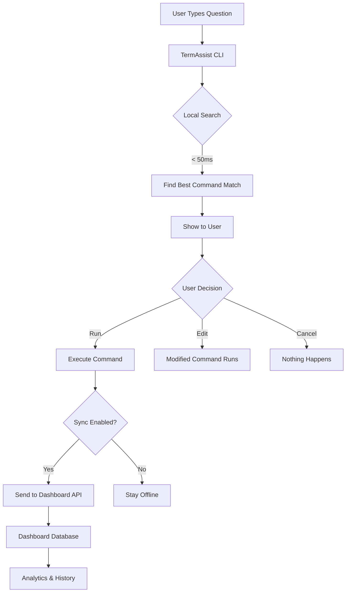
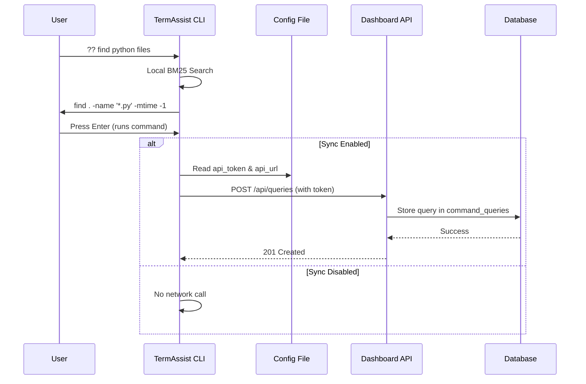
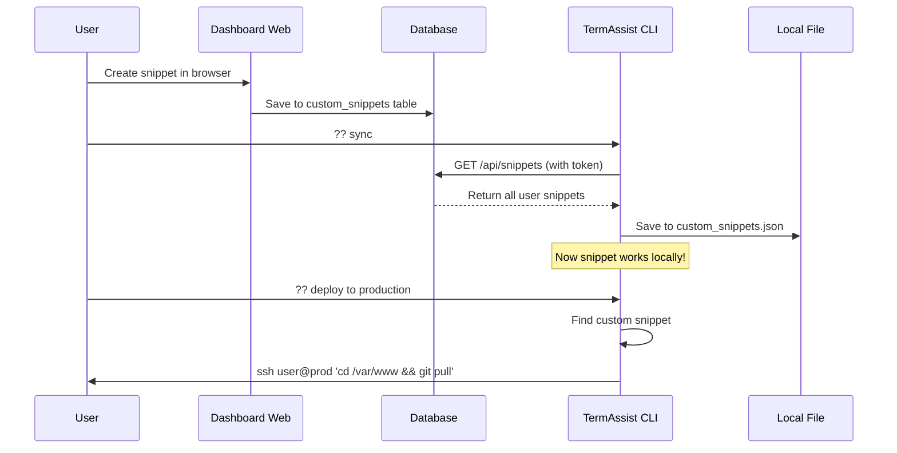

# TermAssist — The Terminal That Understands English

<p align="center">
  <strong>A local, privacy-first terminal assistant that maps natural language to exact bash commands.</strong>
</p>

<p align="center">
  <code>100% Offline</code> · <code>Zero Latency</code> · <code>Complete Privacy</code> · <code>~10MB Install</code>
</p>

---

## 📖 Table of Contents

- [What is TermAssist?](#-what-is-termassist)
- [How It Works (Simple Explanation)](#-how-it-works-simple-explanation)
- [Architecture Overview](#-architecture-overview)
- [Quick Start](#-quick-start)
- [Installation Guide](#-installation-guide)
- [Usage Examples](#-usage-examples)
- [Dashboard Features](#-dashboard-features)
- [Custom Snippets](#-custom-snippets)
- [Privacy & Security](#-privacy--security)
- [Project Structure](#-project-structure)
- [Tech Stack](#-tech-stack)
- [Contributing](#-contributing)
- [License](#-license)

---

## 🎯 What is TermAssist?

TermAssist is a tool that helps you use your computer's **terminal** (also called command prompt or console) by typing **normal English sentences** instead of complicated commands.

### The Problem

Normally, to use a terminal, you need to memorize complex commands:

```
❌ Hard to remember:  find . -name '*.py' -mtime -1
❌ Complex syntax:     tar -czf archive.tar.gz directory/
❌ Easy to typo:       git reset --soft HEAD~1
```

### The Solution

With TermAssist, you just type what you want in English:

```
✅ Easy:  ?? find all python files modified today
✅ Easy:  ?? compress a directory into a tar.gz archive
✅ Easy:  ?? undo last git commit but keep changes
```

TermAssist understands what you mean and shows you the exact command to run!

---

## 🚀 How It Works (Simple Explanation)

```
┌─────────────────────────────────────────────────────────────────┐
│                        YOUR QUESTION                             │
│                   "find python files"                            │
└─────────────────────────┬───────────────────────────────────────┘
                          │
                          ▼
┌─────────────────────────────────────────────────────────────────┐
│                    TERM ASSIST CLI                               │
│                                                                  │
│  Step 1: Break your question into words                         │
│          ["find", "python", "files"]                             │
│                                                                  │
│  Step 2: Search through 250+ commands using BM25 algorithm      │
│          (takes less than 50 milliseconds!)                      │
│                                                                  │
│  Step 3: Find the best match with confidence score              │
│          Match: find . -name '*.py' -mtime -1                   │
│          Confidence: 95%                                         │
│                                                                  │
│  Step 4: Show you the command and ask to run it                 │
│          "🚀 Ready to execute (Edit if needed):"                 │
└─────────────────────────┬───────────────────────────────────────┘
                          │
                          ▼
┌─────────────────────────────────────────────────────────────────┐
│                    YOUR DECISION                                 │
│                                                                  │
│  Option A: Press Enter → Command runs immediately               │
│  Option B: Edit command → Your changes run                      │
│  Option C: Press Ctrl+C → Cancel, nothing happens               │
└─────────────────────────────────────────────────────────────────┘
```

### Key Points:

- ✅ **Everything happens on your computer** - no internet needed for searching
- ✅ **Super fast** - less than 50 milliseconds (0.05 seconds)
- ✅ **Private** - your questions never leave your machine during search
- ✅ **250+ built-in commands** - covering git, docker, npm, networking, and more

---

## 🏗️ Architecture Overview

### High-Level System Flow



### CLI ↔ Dashboard Sync Flow



### Custom Snippets Sync Flow



---

## ⚡ Quick Start

### The Fastest Way (5 Minutes)

```bash
# Step 1: Install TermAssist
npm install -g termassist

# Step 2: Test it immediately
termassist "how to list all files"

# Step 3: Use it!
termassist "find python files"
termassist "undo last git commit"
```

That's it! You're using TermAssist. 🎉

---

## 📦 Installation Guide

### Prerequisites

Before installing, make sure you have:

- ✅ **Node.js** installed (version 16 or higher)
  - Download from: https://nodejs.org
  - Install the "LTS" (Long Term Support) version
- ✅ **Terminal access** on your computer

### Step-by-Step Installation

#### Step 1: Install TermAssist

```bash
npm install -g termassist
```

The `-g` means "global" - this lets you use TermAssist from any folder.

#### Step 2: Verify Installation

```bash
termassist --version
```

You should see: `0.1.0` (or higher)

#### Step 3: Create Account on Dashboard

1. Go to the TermAssist website
2. Click "Sign Up"
3. Create account with Google or Email
4. Go to Dashboard → Settings
5. Click "Generate Token"
6. Copy the token (starts with `ta_`)

#### Step 4: Create Configuration File

**On Windows:**

```powershell
# Create the folder
mkdir $env:USERPROFILE\.termassist

# Create and edit config file
notepad $env:USERPROFILE\.termassist\config.json
```

**On Mac/Linux:**

```bash
# Create the folder
mkdir -p ~/.termassist

# Create and edit config file
nano ~/.termassist/config.json
```

**Add this to the file:**

```json
{
  "api_token": "YOUR_TOKEN_HERE",
  "api_url": "https://termassist.vercel.app",
  "sync_enabled": true
}
```

Replace `YOUR_TOKEN_HERE` with the token you copied in Step 3.

#### Step 5: Set Up the ?? Shortcut (Optional but Recommended)

**On Windows (PowerShell):**

```powershell
# Open your profile
notepad $PROFILE

# Add this line:
function ?? { termassist @args }

# Save, close PowerShell, and reopen it
```

**On Mac/Linux:**

```bash
# For Zsh (default on newer Macs)
echo "alias ??='termassist'" >> ~/.zshrc
source ~/.zshrc

# OR for Bash
echo "alias ??='termassist'" >> ~/.bashrc
source ~/.bashrc
```

#### Step 6: Test It!

```bash
?? how to list files
```

You should see: `ls -la`

🎉 **Congratulations! TermAssist is fully set up!**

---

## 💡 Usage Examples

### Basic Usage

```bash
# Git commands
?? undo last git commit
?? create a new branch and switch to it
?? view git log with one line per commit

# File operations
?? find all python files modified today
?? search for TODO comments in all javascript files
?? find large files bigger than 100mb

# Docker
?? list all running docker containers
?? stop all running docker containers
?? build a docker image from dockerfile

# Networking
?? connect to a remote server via ssh
?? check ip address of machine
?? ping a host to check connectivity

# System
?? monitor system resources in real time
?? show disk usage of current directory
?? kill a process by name
```

### Interactive Mode

If you're not sure what you need, use interactive mode:

```bash
# Just type ?? with nothing after it
??

# A search box appears - start typing keywords
# Use arrow keys to navigate
# Press Enter to select a command
```

### Sync Custom Snippets

```bash
# Download your custom snippets from dashboard
?? sync
```

---

## 🎛️ Dashboard Features

### 1. Overview Page

```
┌─────────────────────────────────────────────────────┐
│  Welcome back, [Your Name]                          │
│                                                     │
│  [Review Queries]  [Manage Snippets]                │
│                                                     │
│  ┌──────────┐  ┌──────────┐  ┌──────────────────┐  │
│  │ Total    │  │ Personal │  │ Recent Query     │  │
│  │ Queries  │  │ Snippets │  │ "find python..." │  │
│  │   142    │  │    8     │  │                  │  │
│  └──────────┘  └──────────┘  └──────────────────┘  │
│                                                     │
│  Productivity Tips  │  Configuration               │
│  - Setup Aliasing   │  [Manage Access Tokens]      │
│  - Enable Telemetry │                              │
│  - Privacy First    │                              │
└─────────────────────────────────────────────────────┘
```

**What you see:**
- Total number of commands you've run
- Number of custom snippets you've created
- Your most recent query
- Quick links to other pages

### 2. Commands Page (Query History)

```
┌─────────────────────────────────────────────────────┐
│  Commands History                                    │
│                                                     │
│  ┌──────────┐  ┌──────────┐  ┌──────────┐         │
│  │ Total    │  │ Top      │  │ Avg      │         │
│  │ Queries  │  │ Category │  │ Response │         │
│  │   142    │  │   git    │  │   12ms   │         │
│  └──────────┘  └──────────┘  └──────────┘         │
│                                                     │
│  [Bar Chart - Last 30 Days Usage]                   │
│  ████  ██  ██████  ███  █████  ██  ████  ██        │
│                                                     │
│  🔍 Search queries...                               │
│                                                     │
│  Time     │ Query           │ Command      │ Resp   │
│  ─────────┼─────────────────┼──────────────┼────────│
│  5m ago   │ find python     │ find . -nam… │ 12ms   │
│  1h ago   │ undo git commit │ git reset    │ 8ms    │
│  3h ago   │ list files      │ ls -la       │ 5ms    │
│                                                     │
│  Page 1 of 8  [<] [>]                              │
└─────────────────────────────────────────────────────┘
```

**What you can do:**
- View all your past queries
- Search through your history
- Copy commands with one click
- See usage patterns in the chart

### 3. Snippets Page (Custom Commands)

```
┌─────────────────────────────────────────────────────┐
│  My Snippets                        [+ New Snippet] │
│                                                     │
│  🔍 Search by label or tags...                      │
│                                                     │
│  ┌─────────────────────┐  ┌──────────────────────┐ │
│  │ Deploy to Prod      │  │ Backup Database      │ │
│  │ ssh user@prod...    │  │ pg_dump mydb > ...   │ │
│  │ [deploy] [server]   │  │ [database] [backup]  │ │
│  │ [✏️] [🗑️]            │  │ [✏️] [🗑️]              │ │
│  └─────────────────────┘  └──────────────────────┘ │
│                                                     │
│  ┌─────────────────────┐  ┌──────────────────────┐ │
│  │ Clean Docker        │  │ Install Dependencies │ │
│  │ docker system prune │  │ npm install          │ │
│  │ [docker] [cleanup]  │  │ [npm] [setup]        │ │
│  │ [✏️] [🗑️]            │  │ [✏️] [🗑️]              │ │
│  └─────────────────────┘  └──────────────────────┘ │
└─────────────────────────────────────────────────────┘
```

**What you can do:**
- Create custom commands
- Edit existing snippets
- Delete snippets you don't need
- Add tags for easy searching
- Search by label or tags

### 4. Settings Page

```
┌─────────────────────────────────────────────────────┐
│  Settings                                            │
│                                                     │
│  Account                                             │
│  Email: user@example.com (read-only)                │
│                                                     │
│  ───────────────────────────────────────────────    │
│  CLI API Token                                       │
│                                                     │
│  ta_abc123def456...  [📋 Copy]                      │
│                                                     │
│  # Add to ~/.termassist/config.json                 │
│  {                                                   │
│    "api_token": "ta_abc123...",                     │
│    "api_url": "https://termassist.vercel.app",             │
│    "sync_enabled": true                             │
│  }                                                   │
│                                                     │
│  [🔄 Regenerate Token]                              │
│                                                     │
│  ───────────────────────────────────────────────    │
│  Sync Preferences                                    │
│                                                     │
│  [✓] Auto-sync snippets to local CLI                │
│                                                     │
│  ───────────────────────────────────────────────    │
│  ⚠️ Danger Zone                                      │
│                                                     │
│  Permanently delete all your data.                   │
│  [🗑️ Delete All Data]                               │
└─────────────────────────────────────────────────────┘
```

**What you can do:**
- Generate API tokens
- Copy token for config file
- Toggle sync on/off
- Delete all your data

---

## 📝 Custom Snippets

### What Are Custom Snippets?

Custom snippets are **your own commands** that you create and save. They work exactly like the built-in TermAssist commands, but you define them yourself.

### How to Create a Snippet

#### Method 1: Using the Dashboard

1. Go to Dashboard → Snippets
2. Click "New Snippet"
3. Fill in the form:
   - **Label**: "Deploy to production server"
   - **Command**: `ssh user@production.example.com 'cd /var/www && git pull'`
   - **Description** (optional): "Deploys latest code to production"
   - **Tags** (optional): `deploy`, `production`, `server`
4. Click "Save"

#### Method 2: Directly in the JSON File

You can also add snippets directly to `~/.termassist/custom_snippets.json`:

```json
[
  {
    "intent": "deploy to production server",
    "command": "ssh user@production.example.com 'cd /var/www && git pull'",
    "category": "custom",
    "description": "Deploys latest code to production"
  }
]
```

### How to Use Custom Snippets

After creating snippets in the dashboard:

```bash
# Step 1: Sync to your computer
?? sync

# Step 2: Use them like any other command
?? deploy to production
```

---

## 🔒 Privacy & Security

### What Stays Local (Never Leaves Your Computer)

- ✅ Your search queries (during matching)
- ✅ The command database
- ✅ Your custom snippets (stored locally)
- ✅ The BM25 search algorithm

### What Can Be Synced (Only If You Enable It)

- ⚠️ Query text (what you typed)
- ⚠️ Matched command (what TermAssist gave you)
- ⚠️ Response time (how long it took)
- ⚠️ Success status (did it run?)

### How to Go 100% Offline

Set `sync_enabled: false` in your config:

```json
{
  "api_token": "",
  "api_url": "https://termassist.vercel.app",
  "sync_enabled": false
}
```

When sync is disabled:
- ❌ No data leaves your computer
- ❌ No API calls are made
- ❌ Dashboard won't show new queries
- ✅ All features still work locally

---

## 📁 Project Structure

```
termassist/
│
├── 📱 Web Application (Next.js)
│   ├── app/
│   │   ├── page.tsx                    # Landing page
│   │   ├── layout.tsx                  # Root layout with fonts
│   │   │
│   │   ├── auth/                       # Authentication
│   │   │   ├── login/page.tsx          # Login page
│   │   │   ├── signup/page.tsx         # Signup page
│   │   │   └── callback/route.ts       # OAuth callback
│   │   │
│   │   ├── dashboard/                  # Dashboard pages
│   │   │   ├── page.tsx                # Overview
│   │   │   ├── commands/page.tsx       # Query history
│   │   │   ├── snippets/page.tsx       # Custom snippets
│   │   │   ├── settings/page.tsx       # Settings & tokens
│   │   │   └── layout.tsx              # Dashboard layout
│   │   │
│   │   ├── blog/                       # Knowledge base
│   │   │   ├── page.tsx                # Blog listing
│   │   │   └── [slug]/page.tsx         # Blog post
│   │   │
│   │   └── api/                        # API routes
│   │       ├── queries/route.ts        # Log queries
│   │       └── snippets/route.ts       # Get/create snippets
│   │
│   ├── components/                     # React components
│   │   ├── layout/                     # Navigation
│   │   ├── ui/                         # Reusable UI
│   │   ├── terminal/                   # Terminal demo
│   │   ├── charts/                     # Analytics charts
│   │   └── snippets/                   # Snippet cards
│   │
│   ├── lib/supabase/                   # Database client
│   └── types/database.ts               # TypeScript types
│
├── 💻 CLI Tool (Node.js)
│   ├── cli/
│   │   ├── index.js                    # Main entry point
│   │   ├── search.js                   # BM25 search engine
│   │   ├── sync.js                     # Dashboard sync
│   │   ├── config.js                   # Config management
│   │   ├── interactive.js              # Interactive mode
│   │   │
│   │   └── data/
│   │       ├── commands.json           # 250+ built-in commands
│   │       └── custom_snippets.json    # User's custom commands
│   │
│   └── config stored in: ~/.termassist/config.json
│
└── 🗄️ Database (Supabase)
    └── supabase/migrations/001_init.sql
        ├── command_queries             # Query logs
        ├── custom_snippets             # User snippets
        └── api_tokens                  # CLI authentication
```

---

## 🛠️ Tech Stack

### Frontend (Web Dashboard)
- **Framework**: Next.js 16
- **Language**: TypeScript
- **Styling**: Tailwind CSS 4
- **UI Components**: Custom with Lucide icons
- **Charts**: Recharts
- **Authentication**: Supabase Auth (Email + Google OAuth)

### Backend (API)
- **Runtime**: Next.js API Routes
- **Database**: Supabase (PostgreSQL)
- **Security**: Row Level Security (RLS), Bearer token auth

### CLI (Terminal Tool)
- **Runtime**: Node.js
- **Search Algorithm**: BM25 (Best Matching 25)
- **Interactive UI**: @inquirer/prompts
- **Terminal Styling**: Chalk (ANSI colors)
- **Config Storage**: JSON files

### DevOps
- **Database Migrations**: SQL
- **Type Safety**: TypeScript + Supabase types
- **Linting**: ESLint
- **Package Manager**: npm

---

## 🤝 Contributing

We welcome contributions! Here's how you can help:

### Ways to Contribute

1. **Add More Commands**: Add new command mappings to `cli/data/commands.json`
2. **Improve Search**: Enhance the BM25 algorithm in `cli/search.js`
3. **UI Enhancements**: Improve the dashboard design
4. **Documentation**: Write better guides and tutorials
5. **Bug Fixes**: Fix issues and improve error handling

### How to Contribute

```bash
# 1. Fork the repository
# 2. Clone your fork
git clone https://github.com/your-username/termassist.git

# 3. Create a branch
git checkout -b feature/amazing-feature

# 4. Install dependencies
npm install

# 5. Make your changes

# 6. Test locally
npm run dev

# 7. Commit and push
git commit -m "Add amazing feature"
git push origin feature/amazing-feature

# 8. Open a Pull Request
```

---

## 📄 License

This project is open source and available under the MIT License.

---

## 🙏 Support

If you find TermAssist helpful, please consider:

- ⭐ Starring the repository on GitHub
- 🐛 Reporting bugs and issues
- 💡 Suggesting new features
- 📢 Sharing with other developers

---

## 📞 Contact

- **Website**: https://termassist.vercel.app
- **Documentation**: https://termassist.vercel.app/blog
- **Dashboard**: https://termassist.vercel.app/dashboard
- **GitHub**: https://github.com/Manoj-ruler/man_cli

---

<p align="center">
  <strong>Made with ❤️ for developers who love the terminal</strong>
</p>

<p align="center">
  <code>TermAssist</code> — The terminal that understands you.
</p>
