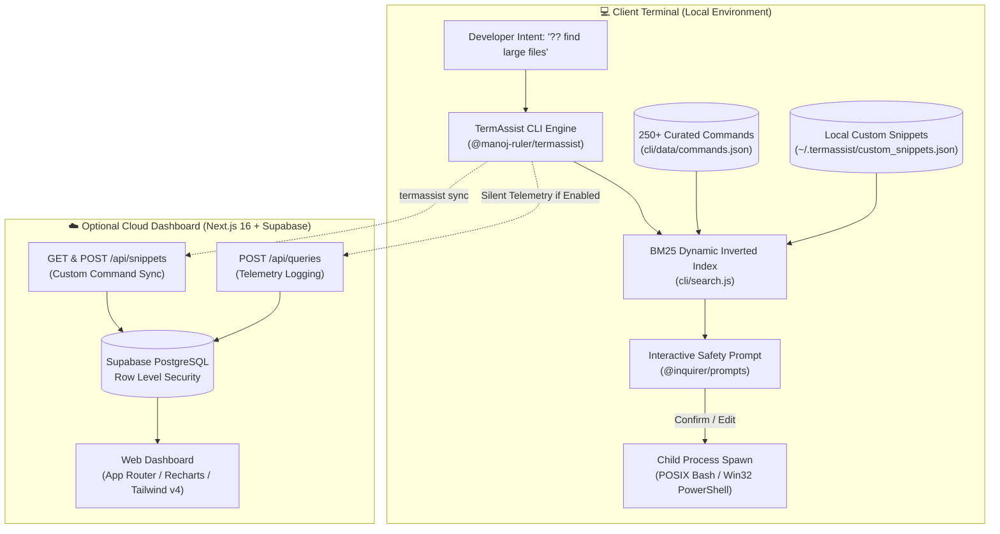
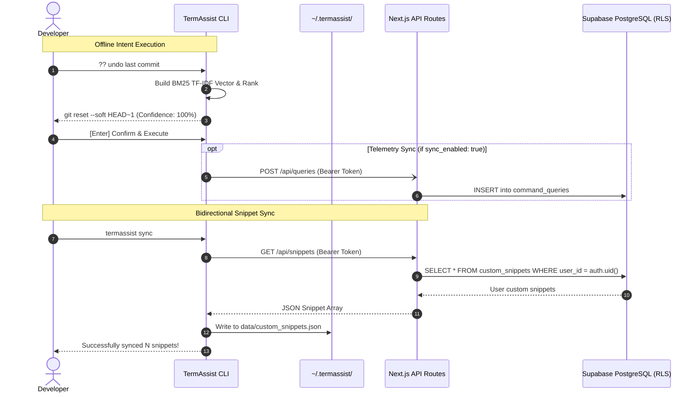

# TermAssist — The Terminal That Understands English

<p align="center">
  <a href="https://termassist.vercel.app">
    
  </a>
  <a href="https://www.npmjs.com/package/@manoj-ruler/termassist">
    
  </a>
  <a href="https://github.com/Manoj-ruler/man_cli">
    
  </a>
  <a href="https://termassist.vercel.app">
    
  </a>
  <a href="https://supabase.com">
    
  </a>
</p>

<p align="center">
  <strong>A lightning-fast, privacy-first terminal assistant and developer dashboard that maps natural language intents to exact bash, zsh, and PowerShell commands.</strong>
</p>

<p align="center">
  <code>⚡ &lt; 5ms Search Latency</code> · <code>🔒 100% Offline & Private</code> · <code>🚫 Zero Cloud AI Latency / Costs</code> · <code>📦 ~10MB Lightweight Footprint</code> · <code>🪟 Cross-Platform (Linux / macOS / Windows)</code>
</p>

---

## 📑 Table of Contents

- [Overview](#-overview)
- [Why TermAssist?](#-why-termassist)
- [System Architecture](#-system-architecture)
- [Search Engine Mechanics (BM25 + Heuristics)](#-search-engine-mechanics-bm25--heuristics)
- [⚡ Quick Start & Installation](#-quick-start--installation)
  - [1. Install via npm](#1-install-via-npm)
  - [2. Instant Verification](#2-instant-verification)
  - [3. Configure Shell Aliases (`??`)](#3-configure-shell-aliases-)
  - [4. Optional: Connect Cloud Dashboard](#4-optional-connect-cloud-dashboard)
- [🎮 CLI Modes & Usage](#-cli-modes--usage)
  - [Natural Language Direct Match](#natural-language-direct-match)
  - [Interactive Command Palette](#interactive-command-palette)
  - [Edit-Before-Execute Safety Shield](#edit-before-execute-safety-shield)
  - [Synchronizing Custom Snippets](#synchronizing-custom-snippets)
- [💡 Example Command Mappings](#-example-command-mappings)
- [🌐 Web Dashboard & Cloud Ecosystem](#-web-dashboard--cloud-ecosystem)
- [🗄️ Database & Security Architecture](#-database--security-architecture)
- [🔬 Research & Evaluation Benchmark](#-research--evaluation-benchmark)
- [📁 Project Structure](#-project-structure)
- [🛠️ Local Development & Setup](#-local-development--setup)
- [🤝 Contributing](#-contributing)
- [📄 License & Author](#-license--author)

---

## 🎯 Overview

**TermAssist** bridges the gap between human thought and the command line. Instead of context-switching to browser tabs, man pages, or waiting on cloud LLMs with unpredictable formatting, TermAssist lets developers express terminal intent in plain English and returns deterministic, production-ready commands in under **5 milliseconds**.

```text
                                 TermAssist Pipeline
   ┌──────────────────────┐      ┌─────────────────────────┐      ┌──────────────────────┐
   │ "undo last commit    │ ───► │  In-Memory BM25 Index   │ ───► │ git reset --soft     │
   │  and keep changes"   │      │  + Exact Intent Booster │      │ HEAD~1               │
   └──────────────────────┘      └─────────────────────────┘      └──────────────────────┘
                                           │ (< 5ms)                         │
                                           ▼                                 ▼
                                ┌─────────────────────┐          ┌──────────────────────┐
                                │ Confidence: 100%    │          │ Interactive Edit &   │
                                │ Category: git       │          │ Prompt Confirmation  │
                                └─────────────────────┘          └──────────────────────┘
```

---

## 🌟 Why TermAssist?

| Capability | Cloud AI Terminal Wrappers | Generic Shell History (`Ctrl+R`) | TermAssist |
| :--- | :--- | :--- | :--- |
| **Search Latency** | 800ms – 3,000ms (Network + LLM) | < 1ms | **< 5ms (Local BM25)** |
| **Privacy & Data Leakage** | ⚠️ Shell context sent to 3rd-party clouds | ✅ Fully Local | **🔒 100% Offline & Air-Gapped Search** |
| **Operational Cost** | 💸 Monthly subscription or API tokens | 🆓 Free | **🆓 100% Free & Open Source (MIT)** |
| **Execution Safety** | ⚠️ Can hallucinate destructive syntax | ✅ Exact past commands | **🛡️ Curated Corpus + Edit-Before-Run** |
| **Cross-Platform OS** | ⚠️ Often POSIX-only | ⚠️ Machine-dependent | **🐧 Linux · 🍎 macOS · 🪟 Windows PowerShell** |
| **Cloud Sync & Analytics**| ⚠️ Tied to proprietary servers | ❌ None | **🌐 Optional Next.js 16 + Supabase Sync** |

---

## 🏗️ System Architecture

### High-Level Architecture


```mermaid
flowchart TD
    subgraph Client Terminal ["💻 Client Terminal (Local Environment)"]
        User["Developer Intent: '?? find large files'"]
        CLI["TermAssist CLI Engine\n(@manoj-ruler/termassist)"]
        BM25["BM25 Dynamic Inverted Index\n(cli/search.js)"]
        Corpus[("250+ Curated Commands\n(cli/data/commands.json)")]
        CustomLocal[("Local Custom Snippets\n(~/.termassist/custom_snippets.json)")]
        Inquirer["Interactive Safety Prompt\n(@inquirer/prompts)"]
        Executor["Child Process Spawn\n(POSIX Bash / Win32 PowerShell)"]

        User --> CLI
        CLI --> BM25
        Corpus --> BM25
        CustomLocal --> BM25
        BM25 --> Inquirer
        Inquirer -->|Confirm / Edit| Executor
    end

    subgraph Cloud Ecosystem ["☁️ Optional Cloud Dashboard (Next.js 16 + Supabase)"]
        API_Q["POST /api/queries\n(Telemetry Logging)"]
        API_S["GET & POST /api/snippets\n(Custom Command Sync)"]
        DB[(Supabase PostgreSQL\nRow Level Security)]
        WebUI["Web Dashboard\n(App Router / Recharts / Tailwind v4)"]

        CLI -.->|Silent Telemetry if Enabled| API_Q
        CLI -.->|termassist sync| API_S
        API_Q --> DB
        API_S --> DB
        DB --> WebUI
    end
```

### Telemetry & Custom Snippet Sync Lifecycle


```mermaid
sequenceDiagram
    autonumber
    actor Developer
    participant CLI as TermAssist CLI
    participant LocalStore as ~/.termassist/
    participant NextAPI as Next.js API Routes
    participant Postgres as Supabase PostgreSQL (RLS)

    Note over Developer,CLI: Offline Intent Execution
    Developer->>CLI: ?? undo last commit
    CLI->>CLI: Build BM25 TF-IDF Vector & Rank
    CLI-->>Developer: git reset --soft HEAD~1 (Confidence: 100%)
    Developer->>CLI: [Enter] Confirm & Execute

    opt Telemetry Sync (if sync_enabled: true)
        CLI-)NextAPI: POST /api/queries (Bearer Token)
        NextAPI->>Postgres: INSERT into command_queries
    end

    Note over Developer,NextAPI: Bidirectional Snippet Sync
    Developer->>CLI: termassist sync
    CLI->>NextAPI: GET /api/snippets (Bearer Token)
    NextAPI->>Postgres: SELECT * FROM custom_snippets WHERE user_id = auth.uid()
    Postgres-->>NextAPI: User custom snippets
    NextAPI-->>CLI: JSON Snippet Array
    CLI->>LocalStore: Write to data/custom_snippets.json
    CLI-->>Developer: Successfully synced N snippets!
```

---

## ⚙️ Search Engine Mechanics (BM25 + Heuristics)

TermAssist uses a highly optimized in-memory implementation of the **BM25 (Best Matching 25)** information retrieval algorithm, enhanced with exact substring heuristics:

1. **Tokenization & Stopword Filtering**: Normalizes query strings, strips non-alphanumeric noise, and filters high-frequency conversational stop-words (`how`, `to`, `do`, `i`, `can`, `the`).
2. **Dynamic Inverted Index**: Pre-computes Term Frequency ($TF$) and Inverse Document Frequency ($IDF$) with smoothing:
   $$\text{IDF}(q_i) = \ln\left(1 + \frac{N - n(q_i) + 0.5}{n(q_i) + 0.5}\right)$$
3. **BM25 Scoring Function**:
   $$\text{Score}(D, Q) = \sum_{i=1}^{n} \text{IDF}(q_i) \cdot \frac{f(q_i, D) \cdot (k_1 + 1)}{f(q_i, D) + k_1 \cdot \left(1 - b + b \cdot \frac{|D|}{\text{avgdl}}\right)}$$
   *(Calibrated with $k_1 = 1.2$, $b = 0.75$)*
4. **Intent Boost Heuristic**: Grants an immediate $+15.0$ score bonus if the normalized user query contains or matches the command intent verbatim.
5. **Confidence Calibration**: Synthetically maps the resulting BM25 score to a percentage scale ($0 - 100\%$). Queries with $\text{Score} < 2.0$ or $\text{Confidence} < 30\%$ are rejected to prevent unintended command execution.

---

## ⚡ Quick Start & Installation

### 1. Install via npm

TermAssist is published under the `@manoj-ruler` npm scope. Install it globally:

```bash
npm install -g @manoj-ruler/termassist
```

> **Requirements**: Node.js `>= 16.0.0` (Node.js 18+ recommended).

### 2. Instant Verification

Test the CLI directly from any terminal window:

```bash
# Query any command intent
termassist "list all files with permissions"

# Test interactive mode
termassist
```

### 3. Configure Shell Aliases (`??`)

For the best experience, configure the `??` shortcut in your preferred shell:

#### 🪟 Windows PowerShell

Add the function to your PowerShell `$PROFILE`:

```powershell
if (!(Test-Path $PROFILE)) { New-Item -Type File -Path $PROFILE -Force }
Add-Content -Path $PROFILE -Value "`nfunction ?? { termassist @args }"
```

*Reload shell:* `. $PROFILE`

#### 🍎 macOS (Zsh) & 🐧 Linux (Bash / Zsh)

Append the alias to your shell configuration:

```bash
# For Zsh (default macOS / modern Linux)
echo "alias ??='termassist'" >> ~/.zshrc && source ~/.zshrc

# For Bash (standard Linux / Git Bash)
echo "alias ??='termassist'" >> ~/.bashrc && source ~/.bashrc

# For Fish shell
echo "alias ??='termassist'" >> ~/.config/fish/config.fish
```

Now you can invoke TermAssist directly with:

```bash
?? compress a directory into tar.gz
```

### 4. Optional: Connect Cloud Dashboard

To sync custom snippets and monitor command analytics across your workstations:

1. Visit [termassist.vercel.app](https://termassist.vercel.app) and sign in.
2. Navigate to **Dashboard → Settings** and copy your **CLI API Token** (`ta_...`).
3. Create or update `~/.termassist/config.json`:

```json
{
  "api_token": "ta_YOUR_GENERATED_TOKEN",
  "api_url": "https://termassist.vercel.app",
  "sync_enabled": true
}
```

---

## 🎮 CLI Modes & Usage

### Natural Language Direct Match

Pass any query as arguments to receive the matched command with category and confidence score:

```bash
$ ?? undo last git commit but keep changes

git reset --soft HEAD~1
category: git  •  confidence: 100%

? 🚀 Ready to execute (Edit if needed): git reset --soft HEAD~1
```

### Interactive Command Palette

Running `termassist` without arguments launches an interactive fuzzy-search prompt over the entire command database and your custom snippets:

```bash
$ termassist

? 🔍 Search commands (type to filter):
❯ git reset --soft HEAD~1  - Undo the last commit, keeping all changes staged
  find . -name '*.py' -mtime -1  - Find Python files modified in the last 24 hours
  tar -czf archive.tar.gz directory/  - Create a gzipped tar archive of a directory
  docker system prune -a --volumes  - Remove all unused containers, networks, and images
```

### Edit-Before-Execute Safety Shield

TermAssist never executes a command blindly. Every match is presented inside an interactive prompt:
- **Press `[Enter]`**: Executes the exact suggested command.
- **Use `[Left/Right Arrow]` & edit text**: Modify flags, parameters, file names, or ports before running.
- **Press `[Ctrl + C]`**: Aborts immediately with zero system changes.

### Synchronizing Custom Snippets

Pull all custom commands created on your web dashboard into your local offline database:

```bash
termassist sync
# or
?? sync
```

---

## 💡 Example Command Mappings

TermAssist includes over 250+ curated commands spanning Unix/macOS and Windows PowerShell:

### 🐙 Git Version Control

| Natural Language Intent | Generated Command (POSIX) | Windows PowerShell Equivalent |
| :--- | :--- | :--- |
| *undo last commit keep changes* | `git reset --soft HEAD~1` | `git reset --soft HEAD~1` |
| *discard all local changes* | `git reset --hard HEAD` | `git reset --hard HEAD` |
| *create and switch branch* | `git checkout -b <branch_name>` | `git checkout -b <branch_name>` |
| *squash last 3 commits* | `git rebase -i HEAD~3` | `git rebase -i HEAD~3` |
| *delete remote branch* | `git push origin --delete <branch>` | `git push origin --delete <branch>` |
| *view git commit history as graph* | `git log --graph --oneline --all` | `git log --graph --oneline --all` |

### 🐳 Docker & Containers

| Natural Language Intent | Generated Command |
| :--- | :--- |
| *remove all stopped containers* | `docker container prune -f` |
| *stop all running containers* | `docker stop $(docker ps -q)` |
| *build image with tag* | `docker build -t <image_name> .` |
| *inspect container logs with follow* | `docker logs -f <container_id>` |
| *remove unused images volumes containers* | `docker system prune -a --volumes` |

### 🔍 File System & Search

| Natural Language Intent | Generated Command (POSIX) | Windows PowerShell Equivalent |
| :--- | :--- | :--- |
| *find python files modified today* | `find . -name '*.py' -mtime -1` | `Get-ChildItem -Recurse -Filter '*.py' \| Where-Object { $_.LastWriteTime -gt (Get-Date).Date }` |
| *search TODO in javascript files* | `grep -rn 'TODO' --include='*.js' .` | `Get-ChildItem -Recurse -Filter '*.js' \| Select-String -Pattern 'TODO'` |
| *find files larger than 100mb* | `find . -type f -size +100M` | `Get-ChildItem -Recurse \| Where-Object { $_.Length -gt 100MB }` |
| *count lines of code in project* | `find . -name '*.ts' \| xargs wc -l` | `(Get-ChildItem -Recurse -Filter '*.ts' \| Get-Content \| Measure-Object -Line).Lines` |

### 🌐 Networking & Diagnostics

| Natural Language Intent | Generated Command (POSIX) | Windows PowerShell Equivalent |
| :--- | :--- | :--- |
| *find process listening on port 3000* | `lsof -i :3000` | `Get-NetTCPConnection -LocalPort 3000` |
| *test port connection to remote host* | `nc -zv host 80` | `Test-NetConnection -ComputerName host -Port 80` |
| *check public ip address* | `curl ifconfig.me` | `(Invoke-WebRequest -Uri "https://ifconfig.me/ip").Content` |

---

## 🌐 Web Dashboard & Cloud Ecosystem

The TermAssist web dashboard ([`app/`](file:///c:/Users/manoj/OneDrive/Desktop/MAN-CLI/termassist/app)) provides a companion experience built with **Next.js 16**, **React 19**, **Tailwind CSS v4**, and **Recharts**.

```text
┌────────────────────────────────────────────────────────────────────────────────────────┐
│  TERMASSIST DEVELOPER DASHBOARD                                                        │
├────────────────────────────────────────────────────────────────────────────────────────┤
│                                                                                        │
│   ┌─────────────────────┐  ┌─────────────────────┐  ┌──────────────────────────────┐   │
│   │ Total Queries       │  │ Active Snippets     │  │ Avg Matching Latency         │   │
│   │ 2,481               │  │ 18                  │  │ 4.2 ms                       │   │
│   └─────────────────────┘  └─────────────────────┘  └──────────────────────────────┘   │
│                                                                                        │
│   📈 Query Frequency (Last 30 Days)           📊 Query Breakdown by Category           │
│   │   ▄█▄   ▄█    ▄                           │   [■ Git: 42%]  [■ Docker: 28%]        │
│   │ ▄█████▄████ ▄███▄                         │   [■ Files: 18%] [■ Network: 12%]      │
│   └───────────────────────────────            └────────────────────────────────────    │
│                                                                                        │
│   🏷️ Custom Snippets Management               🔑 API Token Configuration               │
│   • "Deploy Prod" → ssh prod 'git pull'       • Token: ta_9f82a1... [Copy]             │
│   • "Purge Redis" → redis-cli flushall        • Auto-Sync: Enabled                     │
└────────────────────────────────────────────────────────────────────────────────────────┘
```

- **Analytics & Observability**: Real-time tracking of query trends, top command categories, and latency benchmarks.
- **Custom Snippet Studio**: Create, edit, tag, and organize recurring company/personal scripts for immediate CLI propagation.
- **Interactive Command Directory**: Full searchable web index of all standard commands supported by the search engine.
- **API Token Security**: Issue, rotate, and revoke scoped API keys with instant invalidation.

---

## 🗄️ Database & Security Architecture

The application database schema is managed via Supabase PostgreSQL migrations ([`supabase/migrations/001_init.sql`](file:///c:/Users/manoj/OneDrive/Desktop/MAN-CLI/termassist/supabase/migrations/001_init.sql)) with strict **Row Level Security (RLS)**:

```sql
-- Query Telemetry Logs (Protected by RLS)
create table command_queries (
  id uuid primary key default gen_random_uuid(),
  user_id uuid references auth.users(id) on delete cascade not null,
  query_text text not null,
  matched_command text not null,
  category text,
  response_time_ms integer,
  success boolean default true,
  created_at timestamptz default now()
);

-- User Custom Snippets (Protected by RLS)
create table custom_snippets (
  id uuid primary key default gen_random_uuid(),
  user_id uuid references auth.users(id) on delete cascade not null,
  label text not null,
  command text not null,
  description text,
  tags text[] default '{}',
  created_at timestamptz default now(),
  updated_at timestamptz default now()
);

-- CLI Authentication Tokens
create table api_tokens (
  id uuid primary key default gen_random_uuid(),
  user_id uuid references auth.users(id) on delete cascade not null,
  token text unique not null,
  created_at timestamptz default now()
);
```

### Security & Threat Model

- 🔒 **Air-Gapped Matching**: Local search queries are executed purely in-memory via BM25; no outbound network requests occur during command resolution.
- 🛡️ **RLS Enforced**: All Supabase database tables enforce strict `auth.uid() = user_id` isolation policies.
- 🚦 **Rate Limiting**: Public API endpoints (`/api/queries`, `/api/snippets`) implement in-memory token bucket rate limiting (60 req/min per IP).
- 🔑 **Bearer Token Auth**: CLI telemetry sync authenticates via unique hashed tokens mapped directly to user accounts.

---

## 🔬 Research & Evaluation Benchmark

TermAssist includes an integrated baseline research probing and auditing suite located in [`research/`](file:///c:/Users/manoj/OneDrive/Desktop/MAN-CLI/termassist/research):

```bash
# Run the automated baseline benchmark probe
npm run research:probe
```

### Evaluation Methodology

The probe suite tests the untouched search system against structured probe categories:
- **`exact_intent_match`**: Ground truth intent queries from `commands.json`.
- **`paraphrase`**: Semantic variations testing vocabulary generalization.
- **`natural_language_verbose`**: Conversational user inputs with conversational noise words.
- **`terse_query`**: 1–2 word minimal queries.
- **`out_of_domain`**: Non-terminal queries to verify threshold rejection safety.
- **`ambiguous_risky`**: Potentially destructive commands to measure guardrail reliability.

Machine-readable evaluation summaries are generated directly to `research/results/baseline-probe.json` and `research/results/baseline-probe.csv` with full environment metadata (commit hash, platform, Node.js version, latency percentiles).

---

## 📁 Project Structure

```text
MAN-CLI/termassist/
├── 📱 app/                             # Next.js 16 Web Application (App Router)
│   ├── layout.tsx                     # Root Layout & Typography (DM Sans, Syne, JetBrains Mono)
│   ├── page.tsx                       # Landing Page with Interactive Hero & Video Demo
│   ├── globals.css                    # Tailwind CSS v4 Theme & Custom Glassmorphism
│   ├── proxy.ts                       # SSR Middleware for Route & Auth Protection
│   ├── auth/                          # Supabase Authentication (Login, Signup, Callback)
│   ├── blog/                          # Knowledge Base & Command Guides
│   ├── dashboard/                     # Developer Dashboard
│   │   ├── page.tsx                   # Overview & Analytics Graphs
│   │   ├── commands/page.tsx          # Full Command Query History & Log Inspector
│   │   ├── snippets/page.tsx          # Custom Snippet Studio (Create / Tag / Delete)
│   │   └── settings/page.tsx          # API Tokens & Sync Preferences
│   └── api/                           # REST API Endpoints
│       ├── queries/route.ts           # Telemetry Query Ingestion
│       └── snippets/route.ts          # Custom Snippet Retrieval & Sync
│
├── 💻 cli/                             # Node.js Command Line Interface Package
│   ├── index.js                       # CLI Binary Entrypoint & Argument Parser
│   ├── search.js                      # BM25 Inverted Index & Search Algorithm
│   ├── interactive.js                 # Interactive Terminal Search Mode
│   ├── sync.js                        # Cloud Telemetry & Snippet Synchronization
│   ├── config.js                      # Local Config Handler (~/.termassist/config.json)
│   ├── package.json                   # CLI Package Manifest (@manoj-ruler/termassist)
│   └── data/
│       ├── commands.json              # Curated Corpus of 250+ Multi-Platform Commands
│       └── custom_snippets.json       # Synced Local Custom Snippet Store
│
├── 🔬 research/                        # Benchmark & Evaluation Infrastructure
│   ├── README.md                      # Research Protocol & Experiment Guide
│   ├── probe_baseline.js              # Automated Benchmark Prober
│   ├── probes/initial_queries.json    # Standardized Evaluation Query Dataset
│   └── results/                       # Generated Benchmark Results (JSON & CSV)
│
├── 🗄️ supabase/                        # Database Infrastructure
│   └── migrations/
│       └── 001_init.sql               # PostgreSQL Schema, RLS Policies, Indexes & Triggers
│
├── 🧩 components/                      # Reusable React Components
│   ├── charts/                        # Recharts Visualizations (Area & Bar Charts)
│   ├── landing/                       # Hero Video, Feature Cards, Comparison Grids
│   ├── layout/                        # Responsive Navbar & Footer
│   ├── snippets/                      # Snippet Cards & Tag Filters
│   ├── terminal/                      # Interactive Terminal Simulator
│   └── ui/                            # Buttons, Modals, Badges, CodeBlocks
│
├── 📦 package.json                     # Root Monorepo / Web Package Manifest
├── 📄 tsconfig.json                    # TypeScript Configuration
└── 🛡️ eslint.config.mjs                # Code Quality & Linter Configuration
```

---

## 🛠️ Local Development & Setup

### Prerequisites
- **Node.js**: `>= 18.0.0`
- **npm**: `>= 9.0.0`
- **Supabase Project** (Optional, for dashboard development)

### 1. Clone & Install Dependencies

```bash
git clone https://github.com/Manoj-ruler/man_cli.git
cd man_cli/termassist

# Install root & web dependencies
npm install

# Install CLI dependencies
cd cli && npm install && cd ..
```

### 2. Environment Variables

Create `.env.local` in the `termassist/` directory:

```env
NEXT_PUBLIC_SUPABASE_URL=https://your-supabase-project.supabase.co
NEXT_PUBLIC_SUPABASE_ANON_KEY=your-supabase-anon-key
SUPABASE_SERVICE_ROLE_KEY=your-supabase-service-role-key
```

### 3. Run Web Dashboard Locally

```bash
npm run dev
```

Open [http://localhost:3000](http://localhost:3000) in your browser.

### 4. Link CLI for Local Testing

```bash
cd cli
npm link
```

You can now test local edits to `cli/` across your entire system via `termassist`.

---

## 🤝 Contributing

Contributions make the open-source community an amazing place to learn, inspire, and create. Any contributions you make are **greatly appreciated**!

1. Fork the Project
2. Create your Feature Branch (`git checkout -b feature/AmazingFeature`)
3. Add command mappings to `cli/data/commands.json` or improve algorithms in `cli/search.js`
4. Commit your Changes (`git commit -m 'Add some AmazingFeature'`)
5. Push to the Branch (`git push origin feature/AmazingFeature`)
6. Open a Pull Request

---

## 📄 License & Author

Distributed under the **MIT License**. See `LICENSE` for more information.

**Created & Maintained by**:
- **Author**: Manoj Gaddam
- **GitHub**: [@Manoj-ruler](https://github.com/Manoj-ruler)
- **Repository**: [Manoj-ruler/man_cli](https://github.com/Manoj-ruler/man_cli)
- **Live Platform**: [termassist.vercel.app](https://termassist.vercel.app)

<p align="center">
  <sub>Built with precision for developers who demand speed, privacy, and simplicity in their command line workflow.</sub>
</p>
