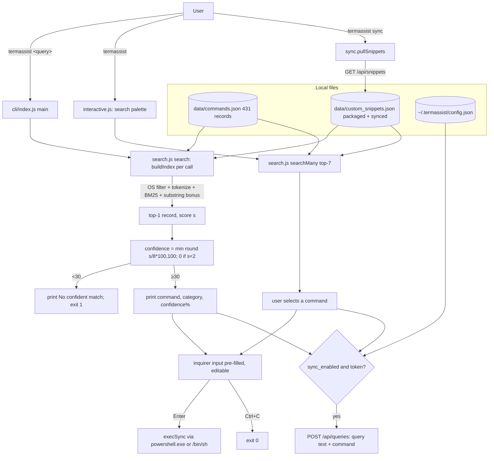
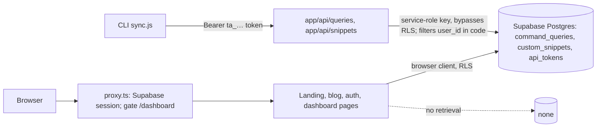
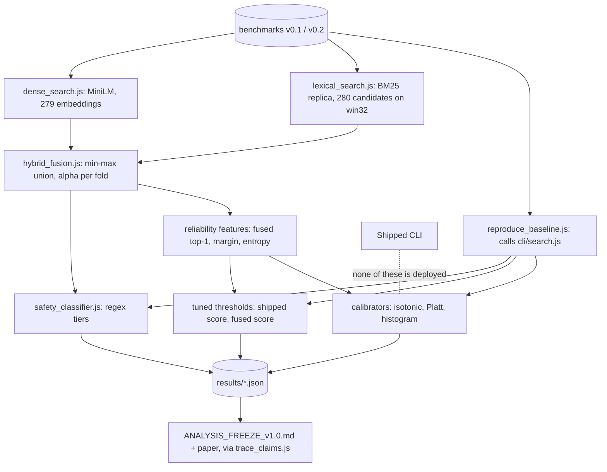
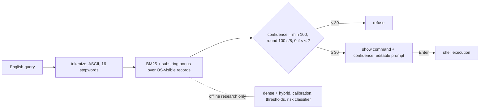

# TermAssist: end-to-end system architecture and functional audit

**Date:** 2026-09-29. Branch `research/improvement`, commit `77f532e`.

**Scope.** This audit covers the system:
- the CLI;
- the web app and API;
- the research retrieval and reliability code;
- the tests.

It covers how these relate to the paper and to Analysis freeze v1.0. The annotator study is out of scope.

**Rules followed.**
- No code, data, benchmark or frozen report was changed. This file is the only file written.
- Every behavioural statement cites the source line it rests on.
- Where I ran something, the command and its output are recorded.
- What I did not or could not run is listed in §0.

**Line numbers** refer to the files as committed at `77f532e`.
- `cli/*` executable code is identical to `master`. The only differences are a code comment and additive corpus fields; see `T21b_REVISION_LOG.md`.

---

## 0. What was inspected, what was run, and what could not be verified

**Inspected in full:**
- `cli/index.js`, `cli/search.js`, `cli/interactive.js`, `cli/config.js`, `cli/sync.js`, `cli/test_filter.js`, `cli/package.json`, `cli/README.md` and `cli/data/custom_snippets.json`;
- the schema and records of `cli/data/commands.json`;
- the root `README.md` and `package.json`;
- `supabase/migrations/001_init.sql`;
- `app/api/**`, `app/auth/callback/route.ts`, `proxy.ts`, `lib/**` and `next.config.ts`.

**Inspected in part:**
- `app/dashboard/settings/page.tsx`, for token generation;
- `components/terminal/TerminalDemo.tsx`;
- `app/page.tsx` and `app/blog/**`, for claims only;
- the research retrieval, fusion, safety and functional-evaluation modules, as needed for §4–§5.

**Run.** All runs were read-only and on Windows 11 (`win32`), Node 24.2.0.

| Command | Result |
|---|---|
| `node cli/test_filter.js` | Prints 5 PowerShell commands for "find python files", then "SUCCESS: Unix find command excluded."; exit 0 |
| `node research/experiments/validate_corpus.js` | 431 records; 279 win32-visible unique intents; 0 errors and 0 warnings; 0/431 human-validated. The v1.0 corpus gate is BLOCKED. Exit 0. |
| `node research/experiments/validate_lexical_replica.js` | "Checked 150 queries. Mismatches: 0" |
| Direct calls to the pure function `require('./cli/search').search(q)` on 15 probe queries (§3.3) | Outputs quoted verbatim below. Two runs gave identical results. Mean 2.56 ms per call over 50 calls. |
| `npm pack --dry-run` on an extracted copy of `master:cli` (in the scratchpad; no tarball written) | 10 files: `README.md`, `config.js`, `data/commands.json`, `data/custom_snippets.json`, `index.js`, `interactive.js`, `package.json`, `search.js`, `sync.js`, `test_filter.js` |

**Not run, and why:**
- **`cli/index.js`.** It can execute a shell command through `execSync` (`cli/index.js:102`). It also creates `~/.termassist/config.json` (`cli/config.js:23–26`). The CLI's printed output below is therefore **derived from the code** for a given `search()` result, not captured from a process.
- **Linux and macOS behaviour.** Only a Windows host was available.
- **The web app.** No Supabase environment variables are available, so the app and API were read, not run.
- **The published npm tarball.** Checking it would need a download, which was not authorized. npm metadata reports 10 files and an unpacked size of 88,568 bytes, while the repository's `master:cli` packs to 126.9 kB. **Whether the published 1.0.1 corpus is byte-identical to `master:cli/data/commands.json` is unverified** (question Q1).
- **Behaviour without a TTY** (piped stdin) of the `@inquirer/prompts` prompt at `cli/index.js:89–92`. Question Q2.

---

## A. System overview (for the paper's architecture section)

TermAssist consists of two independently deployed parts and one offline research pipeline.

1. **The CLI.** This is the published npm package `@manoj-ruler/termassist` 1.0.1, binary `termassist`, and the object of the paper's audit.
   - A query given as command-line arguments is tokenized.
   - The query is scored with BM25 (k₁ = 1.2, b = 0.75) against the command records visible on the current operating system. On Windows these are 279 corpus records plus 1 packaged snippet.
   - A heuristic substring bonus is added.
   - The single highest-scoring record is mapped to a heuristic "confidence" percentage.
   - If the confidence is at least 30, the command is printed with its category and confidence and placed in an editable prompt.
   - Pressing Enter runs the prompt's contents through a shell: `powershell.exe` on Windows, the Node default `/bin/sh` elsewhere.
   - With no arguments, an interactive palette shows the top 7 BM25 matches as the user types.
   - Retrieval uses only local files. An opt-in sync feature (`sync_enabled`, default `false`) sends each matched query to a web API and can download user-defined snippets into the local index.
2. **The web application** (Next.js 16 with Supabase Postgres).
   - It is a dashboard for the optional sync: query history, custom snippets and one API token per user, with Supabase authentication.
   - It performs **no retrieval, ranking, confidence or safety computation.**
   - The landing-page "terminal" is a scripted typing animation (`components/terminal/TerminalDemo.tsx`).
3. **The research pipeline** (`research/experiments/`, Node).
   - It re-implements the CLI's BM25 exactly: `lexical_search.js`, with 0/150 mismatches against the shipped `search()`.
   - It adds components that exist **only offline and are never shipped:**
     - dense retrieval with `Xenova/all-MiniLM-L6-v2` (`dense_search.js`, `@xenova/transformers`, pre-computed embeddings);
     - hybrid min-max fusion (`hybrid_fusion.js`);
     - post-hoc calibrators (isotonic, Platt, histogram);
     - margin/entropy features;
     - F1-tuned out-of-scope and ambiguity thresholds;
     - a regex risk classifier (`safety_classifier.js`);
     - a functional execution check.

**Consequence for the paper.** The shipped system has none of these:
- calibration;
- out-of-scope detection beyond the fixed score rule;
- ambiguity detection;
- risk labelling or display;
- dense or hybrid retrieval;
- clarification;
- alternatives in direct mode.

All reliability mechanisms the paper evaluates are offline research artefacts applied to the shipped retriever's outputs.

---

## B. Component inventory

| Component | Responsibility | Actual implementation | Key files / functions | Status | Issues |
|---|---|---|---|---|---|
| CLI entry | Parse args; dispatch sync, interactive or direct mode; refuse; prompt; execute | `process.argv.slice(2).join(' ')`, then `search()`. Refuses if `confidence < 30 \|\| !command`. `@inquirer/prompts input()` pre-filled with the command, then `execSync` | `cli/index.js:26–113` | Active (shipped) | Command failures are swallowed with exit 0 (`:103–105`). Telemetry is sent before the user acts (`:71–82`). No risk display. |
| Tokenizer | Normalize query and documents | lowercase; remove every character except `a-z0-9`, whitespace and `-`; split; drop 16 stopwords | `cli/search.js:9–13` | Active | Non-ASCII text is deleted (a Spanish query yields no tokens). "it", "me" and "my" are not stopwords. |
| Corpus loading and OS filter | Choose visible records | Keep records with no `os`, or `os` containing `all` or `os.platform()` | `cli/search.js:15–20` | Active | 279 of 431 records on win32. Several `os: all` records are POSIX-only (§4B). |
| Custom snippets | User-defined commands | `cli/data/custom_snippets.json`, merged into the same index, same OS filter | `cli/search.js:23–33`; `cli/sync.js:65–125` | Active; **one snippet ships in the package** | `killall -9 node` has no `os` field, so it is indexed on every OS, and N = 280 on Windows. Sync writes into the package install directory (`sync.js:102`), not `~/.termassist`, contrary to the README. |
| Index | IDF and term frequencies | Rebuilt from disk **on every query**; IDF = ln(1 + (N − df + 0.5)/(df + 0.5)); documents = intent + category + description | `cli/search.js:36–66`, `:71` | Active | Fine at this size: 2.56 ms per call measured. |
| Lexical ranker | Score and choose top-1 | BM25 sum over the **set** of query tokens, plus 15.0 if the letter-stripped query is a substring of the stripped intent **or vice versa**. Strict `>` keeps the first-seen maximum. | `cli/search.js:69–117` | Active | The bonus fires on accidental substrings ("tar" ⊂ "start", §3.3). Ties go to corpus order. |
| Confidence | Show reliability | min(round(s/8·100), 100); 0 if s < 2.0 | `cli/search.js:121–126` | Active | A heuristic rescaling, not a probability. It saturates at 100 for s ≥ 8. |
| Refusal | Abstain | `confidence < 30` gives "No confident match found. Try rephrasing." and exit 1 | `cli/index.js:58–61` | Active | This is the only abstention mechanism. No ambiguity or out-of-scope handling. |
| Interactive palette | Browse top-k | `searchMany(input, 7)`, sorted by score; with no tokens, the first 7 corpus records | `cli/interactive.js:8–31`; `cli/search.js:136–190` | Active | No confidence or refusal in this mode; any listed command can be selected and run. |
| Execution | Run the command | `execSync(finalCommand, {stdio:'inherit', shell: win32 ? 'powershell.exe' : undefined})` | `cli/index.js:99–106` | Active | Full shell semantics. Placeholders run literally. No confirmation beyond pressing Enter on the pre-filled default. |
| Config | Store token, URL and sync flag | `~/.termassist/config.json`, created on first matched query | `cli/config.js` | Active | Token stored in plaintext locally. |
| Sync and telemetry | Upload queries, download snippets | HTTPS/HTTP POST `/api/queries` with `{query_text, matched_command, category, response_time_ms, success:true}`; GET `/api/snippets` | `cli/sync.js:19–60`, `:65–125` | Active, opt-in (default off) | `success` is always `true`. HTTP is allowed if configured. Downloaded commands become executable suggestions. |
| Web: auth | User accounts | Supabase email/password and Google OAuth; `proxy.ts` gates `/dashboard` | `app/auth/**`, `proxy.ts`, `lib/auth-redirect.ts` | Active (deployment unverified) | — |
| Web: API | Telemetry and snippet CRUD for the CLI | Bearer token looked up in `api_tokens` with the **service-role key**, which bypasses RLS; user scoping is enforced by `.eq("user_id", …)` in code | `app/api/queries/route.ts`, `app/api/snippets/route.ts`, `app/api/snippets/[id]/route.ts` | Active | Tokens stored in plaintext with no scope or expiry. The in-memory rate limit exists only on `/api/queries`, keyed on the spoofable `x-forwarded-for`. No length limits on inputs. |
| Web: database | Persistence | 3 tables with RLS policies | `supabase/migrations/001_init.sql` | Active | `api_tokens.token` is plaintext (`:80`). |
| Web: dashboard | History, snippets, token | Supabase browser client under RLS. Token = `ta_` + `crypto.randomUUID()`; regenerating deletes the old one | `app/dashboard/**` (`settings/page.tsx:56–63`) | Active | "Scoped", "rotate" and "revoke" (README) reduce to delete-and-regenerate. |
| Web: landing demo | Marketing | Scripted typing animation | `components/terminal/TerminalDemo.tsx` | Active | Not connected to any retrieval. |
| Research BM25 replica | Full candidate scores | Same formula, same corpus and snippet file, platform passed in | `research/experiments/lexical_search.js` | Research only | 0/150 mismatches with `cli/search.js`. |
| Dense retrieval | Semantic scores | MiniLM mean-pooled, normalized embeddings; cosine | `research/experiments/dense_search.js`, `research/models/corpus_embeddings.json` | Research only | Embeds 279 win32 records. **The packaged snippet is not embedded.** |
| Hybrid fusion | Combine scores | Per-query min-max over the candidate union; α·lex + (1−α)·dense; argmax | `research/experiments/hybrid_fusion.js` | Research only | The union is 280 on Windows (the snippet has dense score 0). |
| Calibrators, detectors, thresholds | Reliability | Isotonic, Platt, histogram; F1-tuned thresholds on dev folds | `research/experiments/isotonic.js`, `run_calibration*.js`, `run_selective_prediction*.js`, `review_r1_*.js` | Research only | Not deployed. |
| Risk classifier | Label risk | Ordered regex tiers (CRITICAL → LOW); unknown commands default to LOW | `research/experiments/safety_classifier.js` | Research only | Misses `killall -9 node` and `curl -X DELETE …` (both LOW); `git checkout -- .` gets only MEDIUM. |
| Functional check | Execution validity | `execSync` in temporary working directories on the host, 8 s timeout, 15 hand-chosen queries | `research/experiments/run_functional_eval.js:1–40` | Research only | This is a working-directory isolation, not an OS sandbox. |
| Tests | Verification | `cli/test_filter.js` (1 query, 1 assertion); `npm test` prints "No tests yet"; research guard scripts | `cli/test_filter.js`, `cli/package.json:13`, `research/experiments/*` | Partial | No unit, integration or CI tests of the CLI or web. |

---

## C. Data-flow walkthroughs

**Method.** The `search()` outputs below are **measured**: direct calls on win32, 2026-09-29. The CLI lines printed after them are **derived** from `cli/index.js:58–68` for that output, not captured from a process.

**1. Supported request: "undo last git commit but keep changes"** (benchmark TA-B001).
- Tokens: `undo, last, git, commit, but, keep, changes`.
- BM25 plus the substring bonus (the stripped query equals the stripped intent) gives s = 42.674, confidence = min(533, 100) = **100**. Returned command: `git reset --soft HEAD~1`.
- The CLI prints the command in bold and `category: git  •  confidence: 100%`.
- It then opens `🚀 Ready to execute (Edit if needed):` with the command pre-filled.
- Enter runs `powershell.exe` with that string. Ctrl+C exits 0 (`:94–95`).
- If sync is enabled, the query and command are POSTed before the prompt appears (`:71–82`).

**2. Ambiguous or low-information requests.**
- **"show the log"** (TA-B105, labelled ambiguous): s = 5.424, confidence **68**, returns `git log --oneline -20`. It is shown and executable. The product has no ambiguity signal, no alternatives in direct mode, and no clarification.
- **"system"** (TA-B194, labelled ambiguous): s = 19.321, confidence **100**, returns `sudo reboot`.
  - The benchmark scores this as `AMBIGUOUS_CORRECT` (`research/results/v0.2/reproduction-results.json`).
  - The research classifier rates it **CRITICAL**.
  - A one-word query therefore yields a machine-reboot command at 100%, and it runs on a single Enter. On Windows `reboot` is not a PowerShell command. The effect on Linux or macOS is a reboot, inferred from the command and not run.
- **"how do i do it"**: all tokens except `it` are stopwords, so s = 5.411, confidence **68**, returning `git checkout -b branch-name`. Run literally, this creates a branch named `branch-name`.

**3. Unsupported or out-of-scope requests.**
- **"teach me how to play guitar"** (TA-B159): no token matches, s = 0, confidence 0. The CLI prints "No confident match found. Try rephrasing." and exits 1. Correct refusal.
- **"recommend me a good recipe for dinner"** (an OOD draft in `v0.2_adjudication_raw.json`): "good" matches `git bisect good`, s = 4.415, confidence **55**, so it is **shown and executable**.
- **"tar"** (TA-B187): no BM25 term match, but "tar" is a substring of "start…", so the bonus alone gives s = 15.000, confidence **100**, returning **`docker compose up -d`**. This is a confident, unrelated command produced purely by the bonus rule.
- **"¿cómo listar los archivos?"**: the non-ASCII characters are deleted and the rest are not corpus terms, so s = 0 and the query is refused.
- **"find files named *.py in ./src && rm -rf /tmp/x"**: the metacharacters are stripped before scoring, giving `Get-ChildItem -Recurse -Filter '*.log'` at confidence 100. The user's `&& rm …` is **not** executed: only the corpus command is pre-filled. The user can, however, type anything into the prompt and it will be run.

---

## D. Architecture diagrams

### D1. CLI (shipped)

### D2. Web (dashboard for sync)

### D3. Research pipeline (offline only) and the combined view

---

## 4. Functional audit

### A. Natural-language input processing
- **Validation.** None beyond the tokenizer. An empty query, or one of punctuation only, gives no tokens and confidence 0, so it is refused (`search.js:74–76`). In direct mode an empty argument list opens interactive mode instead.
- **Normalization.** Lowercase, then strip everything except `a-z0-9`, whitespace and `-`. Consequences:
  - quotes, paths, flags (`--force` keeps its hyphens), `*.py` and `./src` lose their punctuation;
  - **all non-ASCII letters are deleted**;
  - the query and the documents share this normalization.
- **Stopwords.** A fixed set of 16 words (`search.js:9`). The paper's earlier "10-word" figure was corrected by T15. "it", "me", "my" and "please" are not stopwords, which lets vague queries score (§3.2).
- **OS-specific language.** None. The OS affects only which records are visible.
- **Long and multi-intent queries.** Token matches are summed and one record is returned. For example, "compress this folder and then upload it to my server and email me when done" returns `git config --global user.email 'email@example.com'` at confidence 90. Query tokens are de-duplicated (`search.js:88`).

### B. Command corpus and retrieval
- **Schema** (after the research migration; additive):
  - fields: `command_id, intent, command, category, os[], description, risk_level, source, validation_status`;
  - `source` = `curated-v0:legacy` for all records;
  - 0/431 records are `human_validated` (`validate_corpus.js` output).
  - The shipped CLI reads only `intent, command, category, os, description`.
- **OS visibility on win32.** 145 records are `all` and 134 are `win32`. Some `all` records are POSIX-only. A heuristic regex scan (not a manual review) found, among others:
  - `sudo reboot`, `sudo shutdown -h now`;
  - `crontab -e`, `crontab -l`;
  - `tmux ls`, `tmux kill-session`;
  - `sudo !!`, `sudo systemd-resolve --flush-caches`.
- **Placeholders.** About 81 of the 279 Windows-visible commands contain literal placeholders such as `filename`, `package-name`, `branch-name` or `example.com` (heuristic regex). The CLI runs them verbatim if the user presses Enter without editing.
- **Index lifecycle.** Rebuilt from disk on every `search()` call (`search.js:71`). There is no caching and no index file.
- **Lexical scoring.** Standard BM25 with the stated constants. The **bonus** is `exactIntent.includes(cleanQuery) || cleanQuery.includes(exactIntent)` on strings with every non-alphanumeric removed (`search.js:106–111`). It is therefore neither exact matching nor phrase matching: short queries hit any intent containing their letters.
- **Dense and hybrid retrieval.** Research-only (`dense_search.js`, `hybrid_fusion.js`). **The production path uses BM25 only:**
  - no embeddings, no vector store and no LLM in `cli/`;
  - `cli/package.json:29` nonetheless lists the keyword `vector-search`.
- **Ties.** Strict `>` keeps the first record in corpus order (`search.js:113`); `searchMany` uses a stable sort. The result is deterministic, and two identical runs gave identical output. Tie order depends on the file order of `commands.json` and on the appended snippet.
- **Top-k and filtering.** Direct mode returns the top-1 only. Interactive mode returns 7. There is no filtering beyond the OS filter and the confidence-30 refusal.
- **Empty results.** Refused (confidence 0). If every score is 0 the fallback record is `commands[0]`, but its confidence is 0, so it is never shown.
- **Provenance, licence and update process.** Not documented beyond `source: curated-v0:legacy` and the research migration manifest. There is no update process for the shipped corpus.

### C. Confidence and reliability
- **Formula.** c = min(round(100·s/8), 100), and 0 if s < 2.0 (`search.js:121–126`). s is an unnormalized BM25 sum plus an optional 15.
  - **This is a heuristic rescaling, not a probability.**
  - It depends on N, the average document length and the corpus version (IDF). It is therefore not comparable across operating systems (different visible sets) or corpus versions.
  - It saturates at 100 for every s ≥ 8. On v0.1, 73% of shipped confidences are exactly 100.
- **Calibration.** None in the product. The code comment calls it "synthetic confidence percentage", while the README calls it "Confidence Calibration" (README, Search Engine Mechanics §5). Calibration exists only in evaluation, fit on labelled benchmark folds.
- **Presentation.** `confidence: N%` next to the command. The wording invites a probabilistic reading that the paper shows is unjustified: wrong answers average 86%.
- **Terminology.** "Confidence" means the heuristic c in the code, CLI, README and web copy, and the research "hybrid confidence" is a fused score in [0, 1]. The paper uses "shipped confidence" for c and "hybrid confidence" for the fused score, which is consistent as long as the scales are kept separate (the freeze report notes this).

### D. Ambiguity, out-of-scope detection and abstention (production vs research)

| Aspect | Production (`cli/`) | Research (evaluation only) |
|---|---|---|
| Ambiguity detection | **None** | Margin below an F1-tuned threshold (A4) |
| Out-of-scope detection | Only the fixed rule, s < 2.0 (≡ c < 30 on the benchmark) | Tuned threshold on s; detector on the fused top-1 score (F1-tuned per fold) |
| Threshold source | Hard-coded 2.0 and 30 | Tuned on development folds. Features chosen on full-data class means, a disclosed leak. |
| On rejection | One message, exit 1 | — |
| Alternatives or clarification | None in direct mode; top-7 palette only in interactive mode | — |
| Can OOD get a misleading command? | **Yes.** 33/50 v0.2 OOD queries pass the fixed rule (freeze §6); probes: "recipe" → `git bisect good` (55), "tar" → `docker compose up -d` (100) | Evaluated |
| Ambiguous vs OOD distinguishable? | **No.** A single refusal message | Separate detectors |

### E. Command safety and execution
- **Suggests or executes?** It executes. After the user presses Enter on the pre-filled prompt, `execSync(finalCommand, {stdio:'inherit', shell})` runs (`index.js:99–106`).
- **Trigger and confirmation.** A single Enter; the default value is the retrieved command. There is no separate confirmation, no risk display, no dry-run and no `-WhatIf`.
- **Shell semantics.** Everything is passed to a shell unescaped: `powershell.exe` on Windows, `/bin/sh` (the Node default) elsewhere. Chaining, pipes, redirection, `$(...)` and variable expansion are all live.
  - The *user's query* text is never executed; only the corpus command or the user's edit is.
  - Corpus commands include pipelines and `$(docker ps -q)`.
- **Danger handling in the product.** **None.** The `risk_level` corpus field and the research classifier are not used by `cli/`. The classifier is research-only, deterministic regex, and defaults unknown commands to LOW (e.g. `killall -9 node`, `curl -X DELETE`).
- **Effects.** Commands can modify files, git state, processes, packages, network resources and system power state. Examples: `sudo reboot`, `winget uninstall package-name --purge`, `docker stop $(docker ps -q)`, `Start-Process powershell -Verb RunAs`.
- **Bypass.** There is no safety layer to bypass. The user can type any command at the prompt.
- **Sandbox.** None in the product. The research functional check sets the working directory to temporary folders on the host.
- **Supply path.** `termassist sync` writes server-provided `command` strings into the index (`sync.js:88–103`), and they become executable suggestions. Trust rests on the user's account and token, and the server stores them unvalidated.
- **Error handling.** A failed command gives "Command failed to execute or was aborted." and **exit 0**, because the catch at `:103` does not set an exit code. Unexpected exceptions give exit 1 (`:109–112`).

**Concrete high-risk behaviours** (from the code and §C measurements; no destructive command was run):
- (i) "system" returns `sudo reboot` at 100%, runnable with one Enter.
- (ii) "tar" returns `docker compose up -d` at 100%, through the spurious substring bonus.
- (iii) The packaged `killall -9 node` (no `os` field) is offered on every OS; on Linux or macOS it kills all Node processes.
- (iv) About 81 commands with literal placeholders run as written.
- (v) With sync enabled, the query text is uploaded before the user decides whether to run the command.

### F. CLI and web
- **CLI installation and startup.** `npm install -g @manoj-ruler/termassist`.
  - `engines.node >= 14` (`cli/package.json:46–48`), but `@inquirer/prompts` 8.4.1 requires Node `>=20.12` (per `cli/package-lock.json`). Startup on Node 14–20.11 is expected to fail, though this was not run (Q3).
  - No `--help` or `--version` handling. Measured with `search()`:
    - `termassist --help` becomes a search for the token "--help" (s = 0), so it is refused.
    - **`termassist --version` returns `pip install package-name==1.2.3` at confidence 100** (s = 15.000, the substring bonus alone). The user is one Enter away from running a `pip install`.
  - The `??` alias is documentation only.
- **Exit codes.** 0 on success, on a failed command, or on Ctrl+C; 1 on refusal, sync failure or an exception.
- **Non-interactive use.** Not supported by design (an inquirer prompt); behaviour without a TTY is unverified (Q2).
- **Web.** Routes: `/`, `/blog`, `/blog/[slug]`, `/auth/{login,signup,callback}`, `/dashboard{,/commands,/snippets,/settings}`, and the API routes above.
  - It has no retrieval, confidence, risk or refusal UI, so **nothing in the paper's system claims depends on it.**
  - `next.config.ts` transpiles `three` and `@react-three/*`, which are not in `package.json` (stale).
  - No deployment configuration is committed (`vercel.json`, CI and `.env` are all absent).
- **In one interface but not the other.** All retrieval exists only in the CLI. History, analytics and snippet editing exist only in the web.

---

## 5. Consistency with the analysis freeze and the paper

**Paper claim classes:**
1. directly supported by the implementation;
2. supported only by experiment or evaluation;
3. partially supported: needs narrower wording;
4. unsupported or contradicted;
5. not verifiable.

| Paper statement (`content.tex`) | Class | Evidence and required action |
|---|---|---|
| The tool is "a BM25 retriever over 279 Windows commands" / "maps a query to one of 279 Windows commands" | **3** | On win32 the shipped index has **280** records (279 + the packaged `killall -9 node` snippet), confirmed by the research cache (lexical list length 280). The snippet also enters N and avgdl. Say "279 Windows-visible corpus records (plus one packaged user snippet)". |
| Tokenization: lowercase, punctuation stripped, 16-word stopword list | 1 | `search.js:9–13`. Add that non-ASCII characters are dropped and hyphens kept. |
| BM25 (k₁ = 1.2, b = 0.75) over intent, category and description | 1 | `search.js:37`, `:79–80` |
| "+15 bonus when the query nearly matches an intent" | **3** | It is a bidirectional substring test on letter-and-digit-only strings, and it fires on accidental substrings ("tar" → `docker compose up -d`, s = 15.000). State it exactly. |
| Confidence formula, and 0 when s < 2.0 | 1 | `search.js:121–126` |
| Prints the command with "confidence: N%", refuses when N < 30 | 1 | `index.js:58–68` (it also prints the category) |
| An editable prompt pre-filled with the command, which runs (PowerShell on Windows) on Enter; no risk shown | 1 | `index.js:85–106`. On other OSes the shell is `/bin/sh`. |
| Retrieval is local; optional query sync is off by default | 1 | `config.js:14–18`, `sync.js`. It could add that, when enabled, it uploads the query text and command before execution. |
| "We reproduced the published outputs exactly (0/150 mismatches)" | **3** | Reproduced **the archived baseline outputs from the repository's CLI code**. Equality with the npm 1.0.1 tarball is unverified (Q1: size mismatch). Say "archived" or verify the tarball. |
| "Mean latency was 3.3 ms in one run on one machine" | 3 | This is `search()` only, including the per-call index rebuild. Process start, module load and prompt are excluded. Say so. |
| "a few Windows-visible records are Linux commands (e.g., sudo reboot)" | 1 | Heuristic scan: ≥ 8 POSIX-only `os: all` records |
| Hybrid is "a research prototype, not part of the package" | 1 | No dense or hybrid code in `cli/` |
| "Fusion … min-max normalized over all 279 candidates" (App. A) | **3** | The union is 280 on win32 (the snippet has dense = 0). Say "over all candidates (279 corpus records and one snippet)". |
| Recalibration "changes the number shown" | 2 | Evaluation only; the product has no calibrator. The paper already says a deployed calibrator is untested. Keep the conditional wording. |
| The tuned threshold "handles out-of-scope requests better" | 2 | Evaluation only. The product uses the fixed rule. Keep it framed as an evaluated alternative. |
| Risk classifier results | 2 | Research-only classifier. The paper makes no safety claim, which is correct. |
| "The tool already requires an explicit keypress and never executes on its own" (§6) | 3 | True, but the keypress is a single Enter on a pre-filled default. Say "a single Enter on a pre-filled prompt". |
| "No command was run on a user's system: functional evaluation ran in disposable sandboxed directories" | **3** | The commands ran on the host with the working directory set to a temporary folder; this is not an OS sandbox. Say "in disposable temporary directories". |
| Benchmark counts "system" → `sudo reboot` as correct | 5 (evaluation validity) | The benchmark's gold for TA-B194 accepts a POSIX reboot command on a Windows benchmark. This is a gold-standard question, not a system defect. Flag it; do not change the frozen data. |
| Analysis freeze §6 and §8 system-related numbers | 1 / 2 | Freeze numbers derive from the research replica, which equals the shipped `search()` on all 150 queries. Calibration, detector and classifier numbers are class 2. |

No paper claim was found in class 4, except for the web/README copy, which the paper does not use (§7).

---

## 6. The technical contribution, assessed

| Candidate contribution | Implemented? | Evidence | Assessment |
|---|---|---|---|
| Practical end-to-end system | Yes (CLI + dashboard) | Published npm package; web app | Standard engineering: BM25 plus a prompt plus opt-in sync. **Not a research contribution by itself.** |
| Reliability-aware retrieval architecture | **No**, not in the product | Calibration, OOD and ambiguity detection exist only offline | Cannot be claimed as a system. To claim it, you would need to ship the calibrated confidence and thresholds in the CLI and evaluate that artefact. |
| Confidence and abstention layer | Product: heuristic c + fixed refusal. Research: calibrators and tuned thresholds | Freeze §2, §6 | Defensible as an **empirical evaluation** of what such a layer would do, not as an implemented layer |
| Lightweight local command assistance | Yes | Local BM25, ~2.6 ms `search()`, 2 runtime dependencies, opt-in network | A property of the audited tool, not a novel design |
| Comparative empirical study (audit) of the retrieval and reliability mechanisms applied to a shipped tool | Yes (research pipeline) | Freeze v1.0; claim trace; guards; 20-partition check | **This is the paper's actual, defensible contribution**, matching the current framing (D6) |

**Additional evidence needed for any system-contribution claim.** Beyond the current empirical one, you would need:
- a version of the CLI that applies the evaluated mechanisms;
- tests of it;
- measurements of its end-to-end behaviour.

None is needed for the audit paper as framed.

---

## 7. Issue register

**Severity scale:**
- **P0:** undermines correctness or safety of the system;
- **P1:** claim defensibility or substantial functionality;
- **P2:** useful;
- **P3:** polish.

**Fixing the product vs keeping the audit reproducible.** Fixing any product issue changes the audited artefact. Fixes should ship as a new version (e.g. 1.1), with the audited 1.0.1 kept frozen for the paper.

| ID | Sev. | Component | Evidence | Why it matters | Recommended action | Required for paper? |
|---|---|---|---|---|---|---|
| I-1 | P0 | Execution | `index.js:85–106`: a single Enter runs the pre-filled command through a shell. No risk display, confirmation or dry-run. `risk_level` is unused. | Destructive commands (`sudo reboot` for "system" at 100%) are one keypress away | Product 1.1: show the risk tier; require typed confirmation for high/critical; default to "do not run" | **No**: disclose (already in the paper) |
| I-2 | P0 | Corpus / package | `cli/data/custom_snippets.json` ships `killall -9 node` with no `os` field; it is indexed on every OS (N = 280 on win32) | Unvetted developer data in a released package; changes the index statistics | Product 1.1: ship an empty snippet file; store snippets in `~/.termassist` | **Yes (wording)**: correct "279" (§5) |
| I-3 | P1 | Ranker | `search.js:106–111`: the bidirectional substring bonus on stripped strings | Spurious 100% answers for short queries: "tar" → `docker compose up -d`; `--version` → `pip install package-name==1.2.3` | Paper: describe it exactly. Product: require token-boundary or full-intent match | **Yes (wording)** |
| I-4 | P1 | Claims | The npm 1.0.1 unpacked size (88,568 B) differs from `master:cli` (126.9 kB) | "Reproduced the published outputs" may not refer to the same corpus bytes | Download and diff the published tarball (needs your approval), or say "archived outputs from the repository code" | **Yes** |
| I-5 | P1 | Confidence | `search.js:121`: s/8 rescaled and capped; labelled "confidence %" and "calibration" in the README | Users read it as a probability; it saturates | Paper: already framed. Product: rename or calibrate | Paper already correct |
| I-6 | P1 | OOD / ambiguity | Only `s < 2.0` in the product; OOD queries pass with plausible commands | Core behaviour the paper audits | None for the paper (it is the finding) | No |
| I-7 | P1 | Tests | `npm test` is "No tests yet"; one ad-hoc script; no CI | The system description cannot be regression-checked | Add the minimal suite in §8 as research tests; no CLI change needed | **Recommended** |
| I-8 | P1 | Docs | README and npm say "100% Offline, 100% Private", "Air-Gapped", "Confidence Calibration", "vector-search", snippets in `~/.termassist`; `engines >= 14` vs deps `>= 20.12` | Overclaims contradicted by the code | Correct the README and manifest in 1.1 (not in the paper) | No (paper doesn't cite them) |
| I-9 | P1 | Paper wording | "sandboxed directories", "explicit keypress", latency scope, "279 candidates" in App. A | Precision of system claims | Edit `content.tex` (small) | **Yes** |
| I-10 | P2 | Execution | `index.js:103–105` swallows command failures with exit 0 | Scripts and telemetry misreport; `success: true` is hard-coded (`index.js:80`) | 1.1: propagate the child's exit code | No |
| I-11 | P2 | Corpus | ≥ 8 POSIX-only `os: all` records on Windows; ~81 placeholder commands (heuristic) | Wrong-platform or literal-placeholder execution | 1.1: fix the `os` fields; require placeholder substitution before running | No (partly disclosed) |
| I-12 | P2 | Tokenizer | Non-ASCII deleted; "it", "me", "my" not stopwords | Non-English queries always refused; vague queries get confident answers | Document as a limitation | Optional (one clause) |
| I-13 | P2 | Sync | `sync.js:102` writes into the package directory | Fails on read-only global installs (Q4); snippets likely lost on upgrade | 1.1: write to `~/.termassist/` | No |
| I-14 | P2 | Web API | Service-role key; plaintext tokens without scope or expiry; in-memory rate limit on one route keyed on `x-forwarded-for`; no input size limits | Security hygiene of the optional service | Hash tokens; per-route limits; validate lengths | No (web not in the paper) |
| I-15 | P2 | Research consistency | The lexical candidate list includes the snippet, the dense list does not (union 280) | Minor asymmetry in fusion | Disclose in App. A | Yes (one clause) |
| I-16 | P3 | Config | `next.config.ts` transpiles `three`, which is not installed; the repository URL in `cli/package.json` points to `github.com/manoj/termassist` | Staleness | Clean up | No |
| I-17 | P3 | Performance | Index rebuilt per query | 2.56 ms per call measured; irrelevant at this size | None | No |
| Q1 | Question | Package | Is the published tarball's `commands.json` identical to the repository's? | Validity of "published" | Diff after an approved download | Yes, if keeping "published" |
| Q2 | Question | CLI | Prompt behaviour without a TTY (piped input) | Could matter for scripted use | Test in a disposable environment with `execSync` stubbed | No |
| Q3 | Question | Install | Node < 20.12 with `@inquirer/prompts` 8 | Install claim | Test on Node 18 | No |
| Q4 | Question | Sync | Global install on Linux (`/usr/lib/node_modules` not writable) | Sync failure | Test | No |

---

## 8. Tests, reproducibility and operational readiness

**What exists:**

| Kind | What | Status |
|---|---|---|
| Ad-hoc test (CLI) | `cli/test_filter.js`: 1 query, asserts the Unix `find` is not returned on win32 | Passes (run, exit 0). Not wired to `npm test`; Windows-specific assertion. |
| Research validation | `validate_corpus.js` (schema, OS values); `validate_lexical_replica.js` (replica = shipped `search()` on 150 queries) | Pass (run) |
| Research regression | Guards in every Phase 1 / review script; `trace_claims.js` (459 paper numbers) | Pass (run earlier today) |
| Reproducibility | `research/REPRODUCE.md`: fresh clone regenerates everything with 0 files different (T16, 2026-09-28) | Documented; not re-run in this audit |
| Unit, integration, E2E, API | none | — |

**Untested paths that matter for the paper's system description:**
- the confidence formula and thresholds;
- the substring bonus;
- tie order;
- empty and non-ASCII input;
- snippet merging;
- the OS filter on each OS;
- the refusal path and exit code;
- the execution call (shell selection);
- that sync is off by default.

**Smallest meaningful suite.** Add it under `research/tests/` so the audited CLI is not modified. Use Node's built-in `node:test`.

1. `search()` golden tests on win32. Each asserts the command, the score to 3 decimals and the confidence, taken from the frozen reproduction file: TA-B001, TA-B105, TA-B187 ("tar", bonus-only 15.000), TA-B194, TA-B159 (refused), empty string, "!!!", and a non-ASCII query.
2. Formula properties: confidence ∈ {0} ∪ [25, 100]; 0 iff s < 2; capped at 100.
3. Snippet merge: the index size is 280 on win32 while the packaged snippet exists (assert and document).
4. OS filter: for `darwin` and `linux`, stub `os.platform` and assert that no `win32`-only record appears.
5. CLI control flow without execution:
   - load `cli/index.js` with `child_process.execSync` and `@inquirer/prompts.input` stubbed through a `--require` preload;
   - assert refusal gives exit 1 with the message;
   - assert that when a match is found, `execSync` receives the command and `{shell:'powershell.exe'}` on win32;
   - assert Ctrl+C gives exit 0;
   - assert no network call when `sync_enabled` is false (stub `https.request`).

This suite supports every class-1 statement in §5 and needs no product change.

---

## 9. Publication-oriented plan

### Phase A: must fix before the system can be described accurately (paper text only)

| # | Problem | Files | Minimum change | Test | Supports | Effort | Risk |
|---|---|---|---|---|---|---|---|
| A1 | "279 commands/candidates" | `content.tex` §1, §3, App. A | "279 Windows-visible corpus records plus one packaged snippet (280 indexed)" | Claim trace entry: index size from `lexical_search` | §3 System | S | Also check the abstract |
| A2 | Imprecise bonus description | `content.tex` §3 | State the bidirectional substring rule on stripped strings; note that it can fire spuriously | Golden test (TA-B187) | §3 | S | none |
| A3 | "Published outputs" | `content.tex` §3 | Either verify the npm tarball (Q1, needs a download) or say "archived baseline outputs from the repository code" | Diff, or no test | §3 | S | A tarball mismatch would need a disclosure |
| A4 | Latency scope, "explicit keypress", "sandboxed", POSIX shell | `content.tex` §3, §6, Ethics | One clause each | — | §3, §6, Ethics | S | none |
| A5 | Fusion candidate set | `content.tex` App. A | "over all candidates (the snippet has no dense score)" | — | App. A | S | none |

### Phase B: verify, for a defensible description of the audited system

| # | Problem | Files | Minimum | Test | Supports | Effort | Risk |
|---|---|---|---|---|---|---|---|
| B1 | No tests of the described behaviour | new `research/tests/*.test.js` | The §8 suite (items 1–5) | `node --test research/tests` | Every class-1 system statement | M | Stubbing the prompt must never execute anything real |
| B2 | Unverified OS behaviour | the same tests | Stub the platform | as above | the OS-filter claim | S | none |
| B3 | Tarball identity (Q1) | none (read-only diff) | `npm pack @manoj-ruler/termassist@1.0.1`, then diff (**needs your approval to download**) | Byte diff | "published" wording | S | none |

### Phase C: documentation and presentation
- **C1.** Use §10 below as the paper's System Overview (already largely aligned). Put diagram D1 in an appendix if space allows.
- **C2.** Keep "production vs research" explicit in one table (§4D) in the paper's appendix or the artefact README.
- **C3.** Update the repository README and npm description in a later 1.1 release to remove the overclaims (I-8). **This is not part of the paper.**

### Phase D: optional future work (product 1.1; not needed for this paper)
- A risk-aware execution gate (I-1).
- Remove the packaged snippet and move snippets to the home directory (I-2, I-13).
- A token-boundary bonus (I-3).
- A calibrated or renamed confidence (I-5).
- A shipped out-of-scope threshold with a clarification message (I-6).
- Corpus `os` and placeholder fixes (I-11).
- Exit-code propagation (I-10).
- Web token hashing and rate limiting (I-14).
- CI.

Each of these would need its own evaluation before any claim is made about it.

---

## 10. Paper-ready architecture specification

1. **Purpose and intended use.** A local command-line assistant that maps an English request to one command from a fixed, platform-filtered list and offers to run it. It is intended for interactive use by a person who reviews the command.
2. **Design goals and non-goals.**
   - Goals: local retrieval with no model or network in the matching path; deterministic output; a small footprint.
   - Non-goals of the audited version: command generation; calibrated probabilities; risk assessment; out-of-scope or ambiguity detection beyond a score floor; multilingual input.
3. **Architecture.** A single-process Node CLI:
   - argument parsing, then retrieval (`search.js`), then refusal or display, then an editable prompt, then shell execution;
   - an optional, off-by-default sync client for a separate web dashboard (Next.js and Supabase) that stores query logs and user snippets;
   - the dashboard performs no retrieval.
4. **Request lifecycle.** Covered in §A–§C, with the file:line references above.
5. **Retrieval and ranking.**
   - BM25 (k₁ = 1.2, b = 0.75; IDF ln(1 + (N − df + 0.5)/(df + 0.5))) over the tokenized intent, category and description of each record visible on the host OS.
   - On Windows, 279 corpus records plus one packaged snippet.
   - Plus 15 when the letter-and-digit-only query is a substring of the intent or vice versa.
   - Top-1 by score, ties to the earliest record. The index is rebuilt per query.
6. **Confidence and reliability.**
   - Confidence = min(round(100·s/8), 100), set to 0 when s < 2. It is a heuristic score, not a probability, and it is not calibrated in the product.
   - All calibration, detectors and thresholds in this paper are offline analyses of this score and of a research hybrid.
7. **Out-of-scope handling and abstention.** One rule: refuse when confidence < 30, with one generic message. There is no separate ambiguity or out-of-scope handling, and no alternatives in direct mode.
8. **Safety and execution model.**
   - The command is shown with its confidence and category, then placed in an editable prompt.
   - One Enter runs it through `powershell.exe` on Windows or `/bin/sh` elsewhere, with full shell semantics.
   - There is no risk display, confirmation, dry-run or sandbox.
   - Risk tiers in the paper come from an offline, rule-based classifier scored against benchmark labels.
9. **Interfaces.** A direct mode (query as arguments) and an interactive mode (a live top-7 list). The web dashboard is only for optional history and snippets.
10. **Dependencies and deployment.**
    - CLI: Node, with `@inquirer/prompts` 8 (which requires Node ≥ 20.12) and `chalk` 4, distributed on npm.
    - Research: `@xenova/transformers` with `all-MiniLM-L6-v2`, pinned by hash in `REPRODUCE.md`.
    - Web: Next.js 16, Supabase. Its deployment configuration is not in the repository.
11. **Reproducibility and testing.**
    - The research pipeline reproduces from a clean clone (`REPRODUCE.md`).
    - A replica check shows the evaluation's BM25 equals the shipped function on all benchmark queries.
    - Paper numbers are checked by `trace_claims.js`.
    - Product-level tests are minimal (§8).
12. **Limitations.** English-only ASCII tokenization. The heuristic confidence saturates. The substring bonus can fire spuriously. One packaged snippet. POSIX-only records visible on Windows. Literal placeholders. A single-keystroke execution with no risk gate. The web service is outside the evaluation.

**Concise diagram.**

**Component table:** see §B.

**The most important confirmed issues:**
- I-1 (single-Enter execution with no risk gate);
- I-2 (packaged snippet, 280 records);
- I-3 (spurious substring bonus);
- I-4/Q1 ("published" vs archived);
- I-5 (heuristic "confidence");
- I-7 (no tests);
- I-8 (README/npm overclaims);
- I-9 (four wording fixes in the paper).

**Prioritized checklist:**
- [ ] A1–A5 wording fixes in `content.tex`, then rerun the claim trace. Small.
- [ ] B3 or A3: verify the published tarball, or narrow to "archived". Needs your decision on the download.
- [ ] B1–B2: the minimal test suite under `research/tests/`. Medium.
- [ ] C1–C2: the architecture text and production-vs-research table in the paper or artefact README.
- [ ] (After the paper) D: product 1.1.

**Claims that are safe to make:**
- Local BM25 retrieval with the stated constants and formula.
- A heuristic confidence with the stated formula, refusing below 30.
- Edit-then-run on a single Enter via a shell.
- No risk display.
- Opt-in sync, off by default.
- The evaluation's retriever equals the shipped one on all benchmark queries.
- All calibration, detection and risk results are offline analyses.
- Deterministic output.

**Claims to narrow or remove:**
- "279 commands/candidates": say 279 + 1 snippet.
- "nearly matches an intent": state the exact rule.
- "published outputs": say archived, unless the tarball is verified.
- "sandboxed directories": say temporary directories on the host.
- "explicit keypress": say a single Enter on a pre-filled prompt.
- Latency: state that it covers `search()` only.
- Never call the confidence calibrated or probabilistic for the product.
- Never describe the product as offline or private without the sync caveat, or as having out-of-scope, ambiguity or risk handling.

**Assessment.**
- **As an audit object:** the shipped architecture is small, coherent and fully traceable. Every behaviour the paper relies on is visible in about 300 lines of CLI code, and the research replica is verified identical on the benchmark. It is sufficiently coherent to describe as the *subject* of an empirical audit.
- **As a research system contribution:** it is **not** sufficient to present as a reliability-aware system, because none of the evaluated reliability mechanisms is deployed.
- **What is still missing for the paper as framed:**
  - the five small wording corrections (A1–A5);
  - either verification of the published tarball or narrower wording;
  - ideally, the minimal test suite that pins down the described behaviour.
